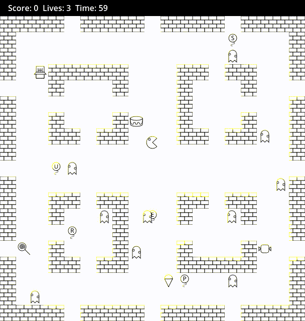

# For Toy Box

## This repository was created for https://www.develteam.com/Game/Toy-Box

#### All sprites in "Placeholders" folder distributed under CC-BY license! More details is here 👉🏼 https://creativecommons.org/licenses/by/4.0/
#### so if you want use these sprites you must leave "Some sprites created by xolatgames" or use your own sprites.
#### But if you want use the source code in your own project you can do with the source code just what you want because it published under MIT license! 😄 

#### What do you need to do?

Earn as many score points as you can!

#### The Development tools:

The Game Engine: **https://godotengine.org/**   v4.3
The Graphics made in: **https://inkscape.org/**
